# PngComparer28

A fork of [EliotJones/BigGustave](https://github.com/EliotJones/BigGustave) c# library with some changes + png comparing and editing functions.

Feel free to help this project.
\
Also, I might make a dart version of this library in the future

---

## Example Usage

### Some basic methods
```csharp
Png image = Png.Open("PATH/TO/IMAGE.png"); // Load Png
Pixel32 pixel32 = image.GetPixel(0, 0); // Gets a pixel
Pixel32[] pixel32s = image.GetPixels(); // Gets all image pixels

// Convert to 2d array. use Png.SizeP to pass original image size.
// SizeP Struct stores an image's Width & Height
Pixel32[,] pixel32s_2d = pixel32s.To2dArray(image.SizeP);
// You can use pixel32s_2d.BackTo1dArray() to turn it back to 1d array

pixel32s_2d.ForEach((x, y) => {
    // Example: replace all pixels with Pixel32.White
    return Pixel32.White;
}); // Result: fully white image

// Average a pixel with an array of other pixels
Pixel32 average = pixel32.Average(pixel32s);

// Clamps pixel's color between 0-255
Pixel32 clamped = new Pixel32(1100, 50, -10).Clamp(); // Result: (255, 50, 0)

```


### Comparing

```csharp

// Comparing using structural similarity index measure (SSIM)
double resultSSIM = ImageComparer.CompareSSIM("Image1.png", "Image2.png");
Console.WriteLine($"MatchPercentage: {resultSSIM * 100}%");

// Fast Comparing using Intersection over union. returns true if images are similar
bool rIOU = ImageComparer.CompareIOUFast("Image1.png", "Image2.png", out float match);
Console.WriteLine($"Matchs: {rIOU} | MatchPercentage: {match * 100f}%");

```
Real comparing! Compare one image with multiple BWMasks using Intersection over union.
```csharp
// BWMask struct: Holds a readonly 256x256 Black and White Png
// with a name for it to help image comparing result
BWMask[] bWMasks = [
    new BWMask(Png.Open("../Image1.png"), "Sky"),
    new BWMask(Png.Open("../Image2.png"), "Cat"),
    new BWMask(Png.Open("../Image3.png"), "Landscape at night"),
];

bool result = ImageComparer.CompareIOU(Png.Open("../Image0.png"), bWMasks, out float bestMatchPerc, out BWMask bestMatchMask);
Console.WriteLine($"Compared with {bWMasks.Length} masks:\n" +
    $"Matchs: {result} | Best Match Percentage: {bestMatchPerc}\n" +
    $"{bestMatchMask.MaskName}");
```
\
Currently, there are only 2 comparing algorithms:

| Class | Name | Accuracy | Speed |
| :-------: | :--------------: | :------------------------: | :-----------: |
| IOU | Intersection Over Union | Very low. turns image into 256x256 Black and White before comparing | Fastest
| SSIM | Structural Similarity Index Measure | Good | Slow

### Editing
There are lots of editing methods. lets take a look at this example:
```csharp
var png = Png.Open("PATH/TO/IMAGE.png");
var pixels = png.GetPixels();

pixels.Grayscale(); // Grayscales image
pixels.Contrast(-0.3f); // -30% Contrast
pixels.Saturation(0.55f); // +55% Saturation

// Save edited png
PngBuilder editedPng = PngBuilder.FromPixel32_2d(pixels.To2dArray(png.SizeP), png.HasAlphaChannel);
await File.WriteAllBytesAsync("PATH/TO/Save.png", editedPng.Save());
```
See original [BigGustave repository](https://github.com/EliotJones/BigGustave) for PngBuilder guides


List of all available Editing methods:

**Input image**:


Method / Extension | Output |
:------: | :------: |
| Resizers.Bilinear(ref image, new(1000, 1000)) |  |
| Pixel32[].Brightness(0.5f) | 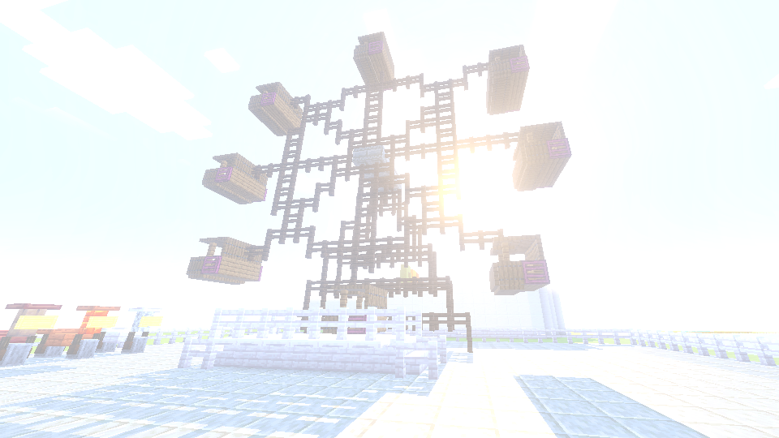 |
| Pixel32[].Contrast(0.5f) |  |
| Pixel32[].Saturation(0.5f) | 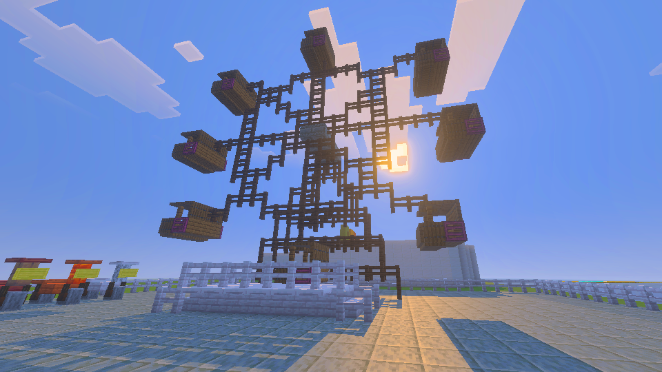 |
| Pixel32[].Vibrance(0.5f) | 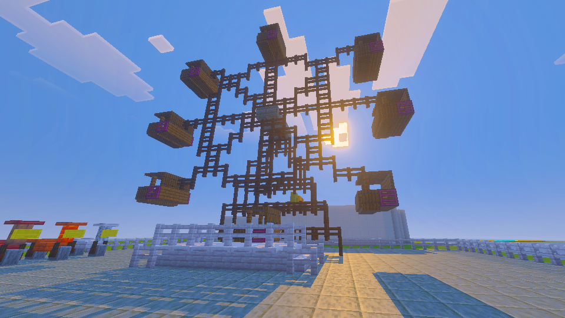 |
| Pixel32[].BW() | 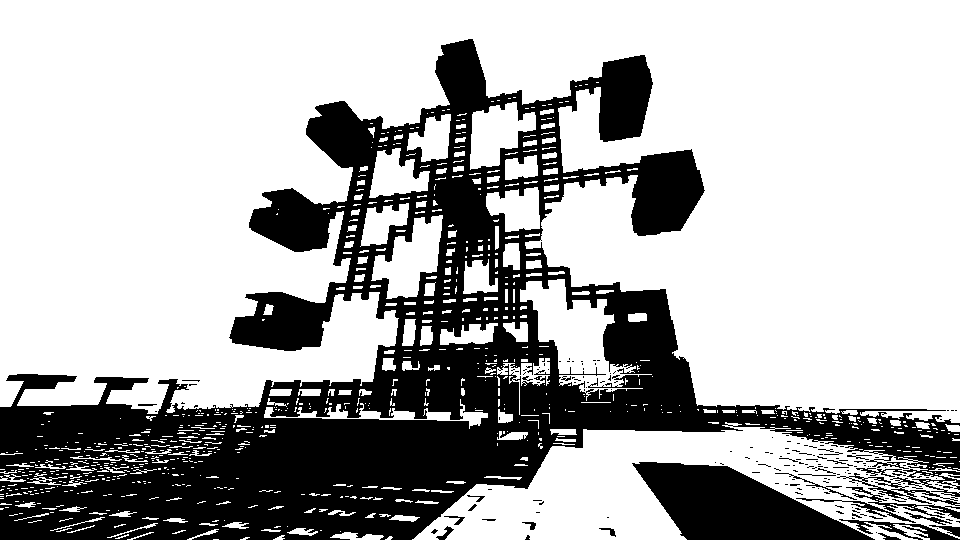 |
| Pixel32[].Grayscale() |  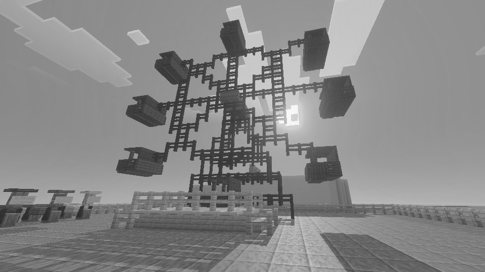 |
| Pixel32[].InvertColors() | 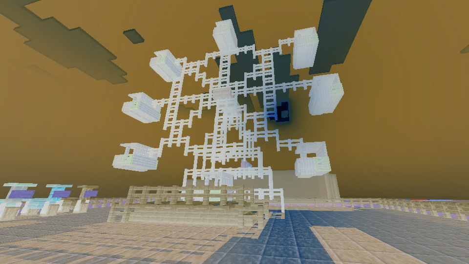 |
| Pixel32[].ColorOverlay(Pixel32.Red) | 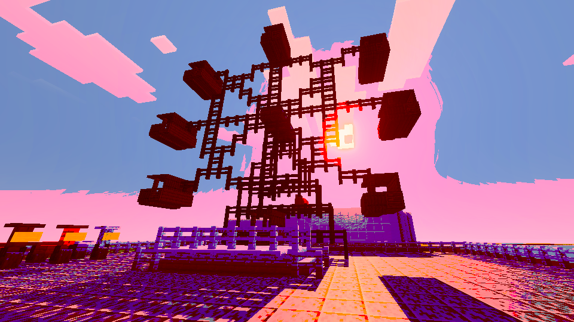 |
| Pixel32[].Bloom() | 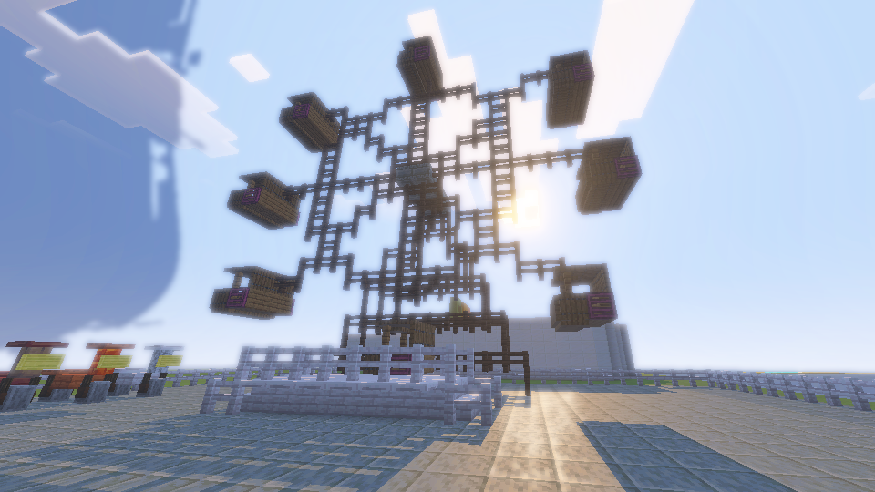 |
| Pixel32[,].GaussianBlur() |  |
| Pixel32[,].KawaseBlur() | 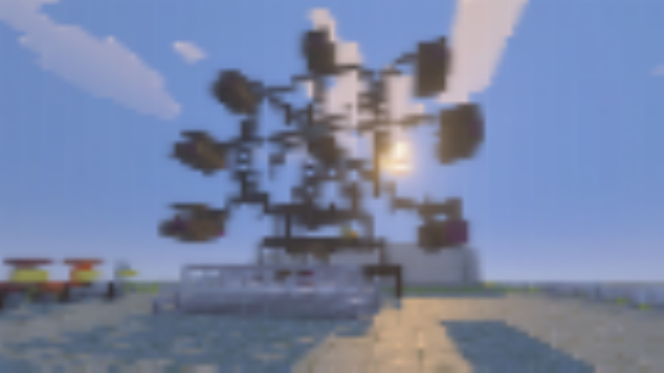 |
| Pixel32[,].FrostedGlassBlur() | 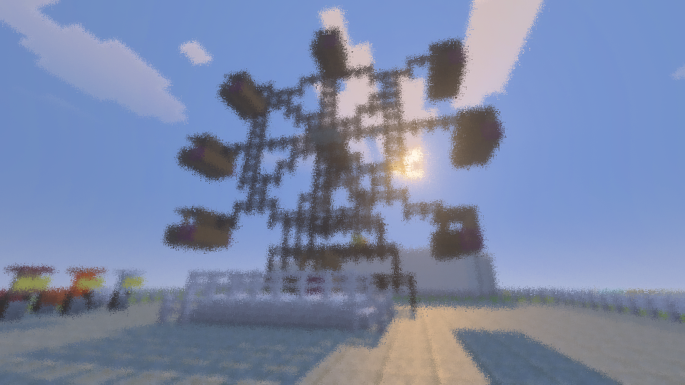 |
| Pixel32[,].LensBlur() | Method is not implemented yet. feel free to help |


Also, there are some blending methods. all can be used with this method:

```csharp
// Method is under PngComparer28.Photography namespace and returns Png
BlendingUtils.Blend(string imagePath, string image2Path, BlendingMode blendingMode);
// or ↓
BlendingUtils.Blend(Png png, Png png2, BlendingMode blendingMode);
```
**Input images**:
 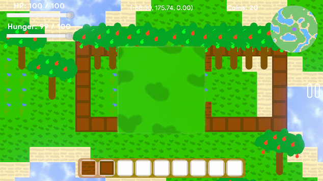

BlendingMode | Output |
:------: | :------: |
| BlendingMode.Darken | 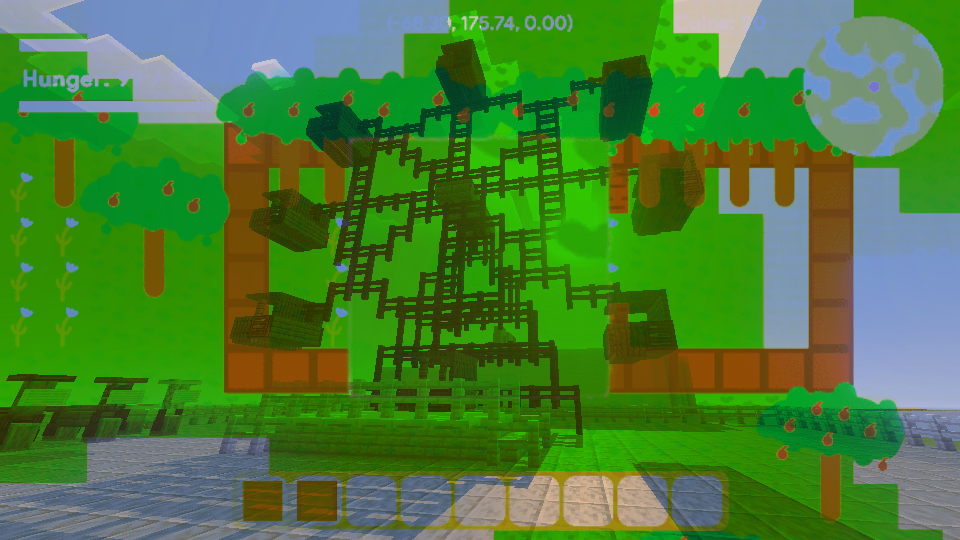 |
| BlendingMode.Lighten | 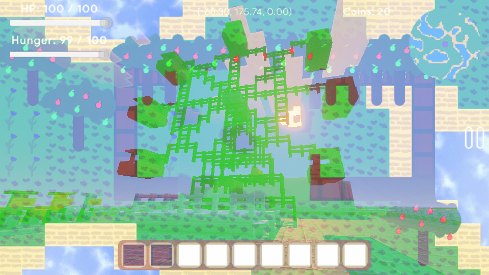 |
| BlendingMode.Multiple | 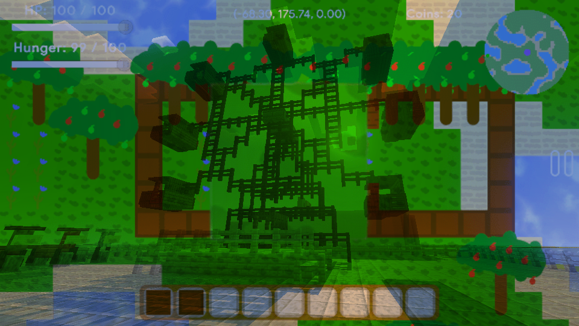 |
| BlendingMode.Screen | 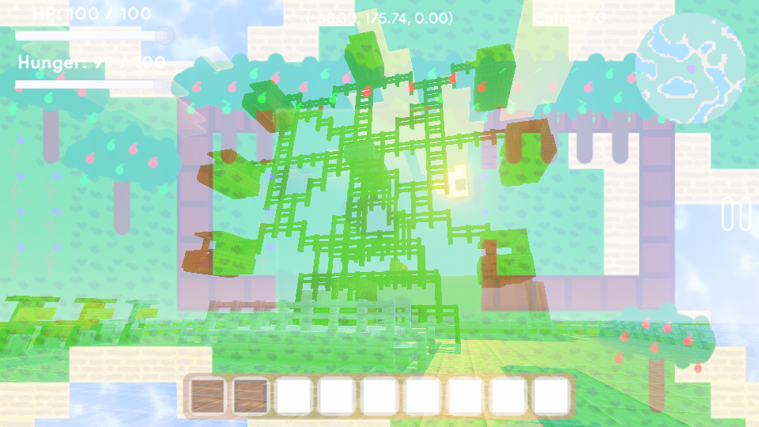 |
| BlendingMode.Overlay | 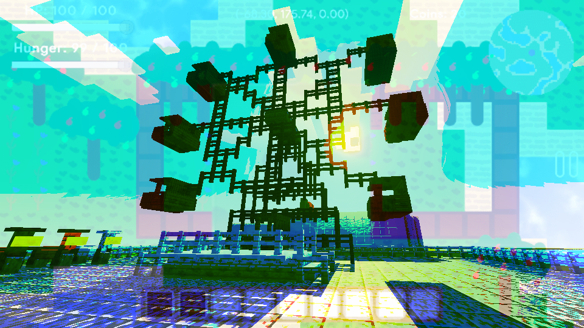 |
| BlendingMode.ColorBurn |  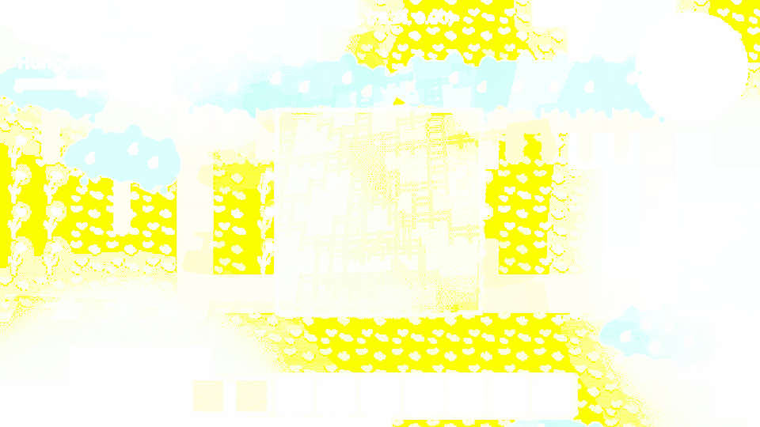 |

More editing methods and blending modes are coming soon!

---

## TODO

- [ ] Support Jpg/Jpeg (by encoding it to png right after load)
- [ ] Edge detecting
- [ ] More Adjustments (Like hue, gamma, shadows, midtones, highlights, ~~color overlay~~ and more)
- [ ] Implement Lens Blur method
- [ ] Add spiral and radial blur
- [ ] Add wiki tab with guide for every method and struct
- [x] ~~Add structural similarity index measure (SSIM) image comparing~~
- [x] ~~Add Intersection over union (IOU) image comparing~~
- [x] ~~Some simple editing functions like black and white, blur and more~~

---

## Special thanks & Open source licenses

- [EliotJones/BigGustave](https://github.com/EliotJones/BigGustave) for BigGustave png decoder library ([Unlicense](https://github.com/EliotJones/BigGustave/blob/master/LICENSE))
- [ChrisLomont/SSIM](https://github.com/ChrisLomont/SSIM) for SSIM library ([MIT](https://github.com/ChrisLomont/SSIM/blob/master/LICENSE.txt))
